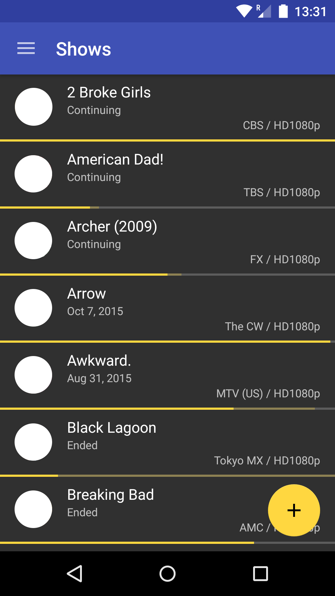
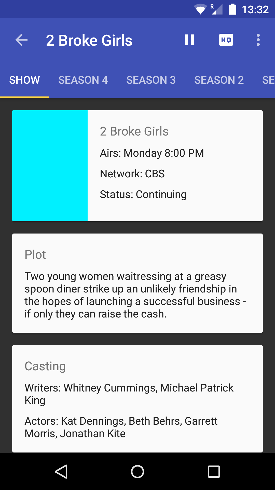
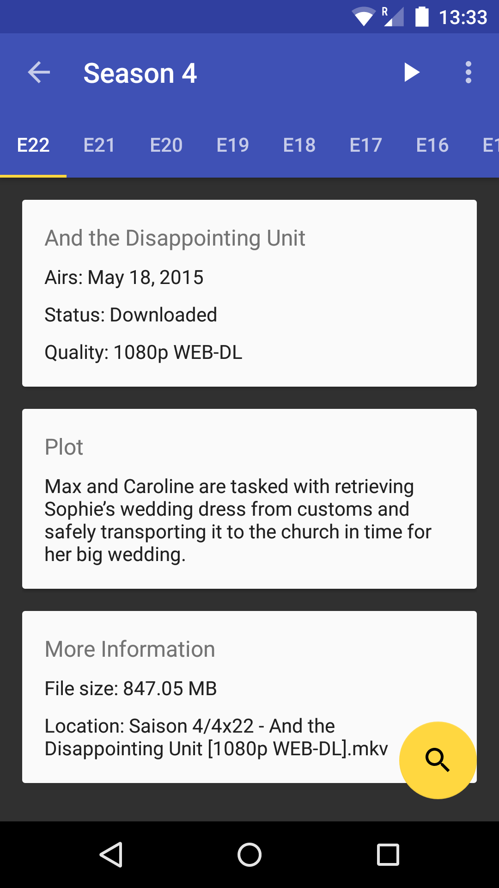

# ShowsRage [](https://travis-ci.org/MGaetan89/ShowsRage) [](https://coveralls.io/github/MGaetan89/ShowsRage?branch=master)

**ShowsRage** is an Android application that allows you to manage your *[SickRage](https://www.sickrage.tv/)* installation.

Support for *[SickBeard](http://www.sickbeard.com/)* (or any other variant) is not guaranteed, but the main features should work properly.

## Features

*ShowsRage* intend to provide the same features as on the web interface, packed inside a modern and easy-to-use Android application.

The following features are currently available:

- Support Android 4.0.3 and up
- Based on [Material Design](http://www.google.com/design/)
- Shows information:
    - List your shows
    - Get detailed show information with *[OMDb](http://www.omdbapi.com/)* integration
    - List a show seasons and episodes
    - Easy access to *[IMDb](http://www.imdb.com/)*, *[The TVDB](http://thetvdb.com/)* and *[TV Rage](http://www.tvrage.com/)*
- Shows management:
    - Add a new show
    - Pause/Resume a show
    - Change show quality
    - Delete a show
- Episode management:
    - Search for an episode
    - Set episode status
    - Stream a downloaded episode
- List of coming episodes
- history
- Logs
- Shows statistics
- Update *SickRage* (requires *SickRage* 4.0.30)

More features can be added in future releases upon [request](https://github.com/MGaetan89/ShowsRage/issues), but please search for an existing request first.

## Screenshots







## Trying the application

The application is not yet publicly available on the Play Store yet.

However, it is possible to have an early access to the application. To do so, simply follow the instructions [here](https://play.google.com/apps/testing/com.mgaetan89.showsrage).

All feedbacks/feature requests/bug reports are welcome and will be taken into account.

# License

```
Copyright 2015 MGaetan89

Licensed under the Apache License, Version 2.0 (the "License");
you may not use this file except in compliance with the License.
You may obtain a copy of the License at

   http://www.apache.org/licenses/LICENSE-2.0

Unless required by applicable law or agreed to in writing, software
distributed under the License is distributed on an "AS IS" BASIS,
WITHOUT WARRANTIES OR CONDITIONS OF ANY KIND, either express or implied.
See the License for the specific language governing permissions and
limitations under the License.
```
